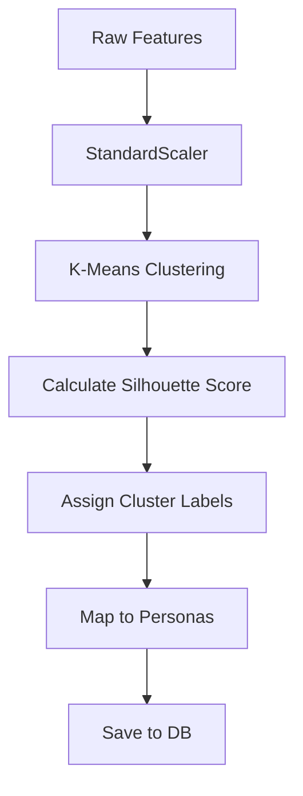

# Machine Learning Design Document (MLDD)
## Part 2: Machine Learning & Analytics Engine
**Project:** Customer Lifetime Value (CLV) & Customer Intelligence Platform

---

## 1. Customer Segmentation

### Purpose & Business Problem
Segmentation transforms a monolithic customer base into actionable cohorts. By understanding distinct personas (e.g., "Champions," "At-Risk," "Hibernating"), marketing teams can tailor campaigns, allocate budgets efficiently, and prevent churn.

### Inputs & Workflow
* **Inputs:** 24 engineered features (specifically RFM Core: Recency, Frequency, Monetary value).
* **Workflow:** Data Scaling (StandardScaler) $\rightarrow$ Dimensionality Reduction (PCA if needed) $\rightarrow$ Clustering Algorithm $\rightarrow$ Cluster Profiling $\rightarrow$ Output to DB.

### Algorithms & Selection
1. **K-Means (Primary Choice):**
   * **Why:** Fast, scalable, easily interpretable.
   * **Advantages:** Excellent for spherical clusters (like standardized RFM data).
   * **Disadvantages:** Sensitive to outliers; requires predefined $k$.
2. **DBSCAN (Alternative):**
   * **Why:** Density-based clustering.
   * **Advantages:** Automatically detects outliers (noise); doesn't require $k$.
   * **Disadvantages:** Struggles with varying densities; hard to tune `eps`.
3. **Hierarchical Clustering (Alternative):**
   * **Why:** Builds a tree of clusters (dendrogram).
   * **Advantages:** Intuitive visual interpretation; no predefined $k$.
   * **Disadvantages:** Computationally expensive ($O(N^3)$), unusable for millions of rows.

### Evaluation Strategy
* **Elbow Method:** Plot Within-Cluster Sum of Squares (WCSS) against $k$ to find the inflection point.
* **Silhouette Score:** Measures cohesion vs. separation (Range: -1 to 1). We target $> 0.5$.
* **Davies–Bouldin Index:** Ratio of within-cluster scatter to between-cluster separation (Lower is better).

### Cluster Interpretation & Actions
* **Cluster 0 (Champions):** High F, High M, Low R. *Action: Upsell, VIP rewards.*
* **Cluster 1 (At Risk):** High F, High M, High R. *Action: Aggressive win-back campaigns.*
* **Cluster 2 (Hibernating):** Low F, Low M, High R. *Action: Re-activation discounts.*

---

## 2. Customer Lifetime Value (CLV) Prediction

### Business Objective & Formulation
Predict the total future revenue a customer will generate over a specific timeframe (e.g., 12 months). This is a **Regression** problem.
* **Target Variable ($Y$):** Sum of transaction amounts for the customer between $T_0$ and $T_{12}$.

### Feature Selection & Importance
We rely heavily on Group 1 (RFM) and Group 3 (Behavior) features. We will use Tree-based feature importance to select the top predictors (e.g., `total_monetary_value`, `avg_order_value`, `total_sessions`).

### Algorithms & Selection
1. **LightGBM (Primary Choice):**
   * **Why:** Histogram-based gradient boosting. Extremely fast, handles missing values naturally, highly accurate.
2. **XGBoost (Strong Contender):**
   * **Why:** Industry standard for tabular data. 
   * **Disadvantages:** Slightly slower than LightGBM on massive datasets.
3. **CatBoost:** Excellent if categorical features dominate (e.g., `location`, `segment`), handles them natively without One-Hot Encoding.
4. **Random Forest Regressor:** Good baseline; handles non-linear relationships but tends to overfit deep trees.
5. **Linear Regression:** Used only as an interpretable baseline. Fails to capture non-linear feature interactions (e.g., high recency + high frequency).

### Evaluation Metrics
* **RMSE (Root Mean Squared Error):** Penalizes large errors heavily (crucial for revenue prediction).
* **MAE (Mean Absolute Error):** Average dollar amount the prediction is off by. Highly interpretable by business.
* **MAPE (Mean Absolute Percentage Error):** Percentage error.
* **$R^2$:** Variance explained by the model.

### Business Interpretation
If CLV prediction is > $1000, Customer Acquisition Cost (CAC) limit can be safely increased for that segment.

---

## 3. Churn Prediction

### Business Definition & Target Creation
**Churn** is defined as no purchases/activity within a specific threshold (e.g., 90 days for retail, subscription cancellation for SaaS). This is a **Binary Classification** problem ($1 = \text{Churned}$, $0 = \text{Retained}$).

### Handling Class Imbalance
Churn datasets are inherently imbalanced (e.g., 90% retained, 10% churned).
* **Technique:** SMOTE (Synthetic Minority Over-sampling Technique) or adjusting `scale_pos_weight` natively in XGBoost/LightGBM.

### Algorithms & Selection
1. **XGBoost Classifier (Primary Choice):**
   * **Why:** Handles imbalanced tabular data flawlessly. High capacity for complex feature interactions.
2. **Logistic Regression (Baseline):**
   * **Why:** Fast, explainable coefficients. Used to establish a baseline ROC-AUC.

### Evaluation Metrics
We **cannot** rely on Accuracy. If 90% of customers stay, a model predicting "everyone stays" is 90% accurate but useless.
* **ROC-AUC:** Area under Receiver Operating Characteristic curve. Measures ability to separate classes.
* **PR Curve (Precision-Recall):** Better than ROC for heavily imbalanced data.
* **Recall:** Out of all actual churners, how many did we catch? (Crucial metric for churn).
* **F1-Score:** Harmonic mean of Precision and Recall.

---

## 4. Purchase Propensity Model

### Problem Formulation
Predicting the probability ($0.0 \rightarrow 1.0$) that a customer will make a purchase in the next 7/14/30 days.

### Calibration
Tree models (like Random Forest) push probabilities away from 0 and 1. We must apply **Platt Scaling (Sigmoid Calibration)** or **Isotonic Regression** so the output probability strictly matches real-world likelihood (e.g., a 0.8 score means an 80% real-world chance of purchasing).

### Business Usage
* Score $> 0.8$: Do **not** send a discount (they will buy anyway; sending a discount hurts margins).
* Score $0.4 - 0.7$: Send a 10% discount (on the fence).
* Score $< 0.4$: Send aggressive 30% win-back discount.

---

## 5. Product Recommendation Engine

### Approaches
1. **Content-Based Filtering:**
   * **How:** Recommends products similar to what the user bought based on product attributes (`category`, `price`).
   * **Similarity Calculation:** Cosine Similarity on TF-IDF or Embedding vectors.
   * **Advantage:** No cold-start problem for new products.
2. **Collaborative Filtering:**
   * **How:** "Users who bought this also bought..." Uses User-Item interaction matrix. Matrix Factorization (SVD).
   * **Disadvantage:** Cold-start problem for new users/products.
3. **Hybrid Model (Primary Choice):**
   * Combines both to mitigate the cold-start problem while capturing deep user-item latent similarities.

---

## 6. Explainable AI (XAI)

### Why Explainability Matters
A marketer needs to know *why* a customer is marked as 95% likely to churn in order to intervene properly.

### Global vs. Local Explanations
* **Global:** Overall model behavior (e.g., `days_since_last_purchase` is the #1 feature driving churn universally).
* **Local:** Individual prediction (e.g., Customer A is churning *specifically* because they had 2 `high_severity_tickets` last week).

### Implementations
* **SHAP (SHapley Additive exPlanations):** The gold standard. Grounded in game theory. We will calculate SHAP values for every prediction and store the top 3 driving features for each user in the database.
* **LIME:** Faster local proxy model.
* **Partial Dependence Plots (PDP):** Shows the marginal effect of one feature (e.g., how probability of churn spikes as support tickets increase).

---

## 7. Business Recommendation Engine (Rules-Based)

### Translating ML to Actions
The ML model outputs raw probabilities. The Business Engine uses Decision Trees/Rules to map probabilities to CRM actions.

| CLV Prediction | Churn Probability | Support Friction | **Recommended Action** |
| :--- | :--- | :--- | :--- |
| High (>$500) | High (>70%) | Low | **VIP Win-back Email + 20% Discount** |
| High (>$500) | High (>70%) | High (>2) | **Customer Success Manager Manual Call** |
| Low (<$50) | High (>70%) | Low | **Automated generic drip campaign (Do not spend CAC)** |
| High (>$500) | Low (<20%) | Low | **Upsell / Cross-sell campaign** |

---

## 8. Model Evaluation Framework

### The Pipeline
1. **Train/Test Split:** Time-based split (e.g., train on 2024, test on Jan 2025) is mandatory to prevent data leakage in time-series business data.
2. **Cross-Validation:** $K$-Fold CV (typically $K=5$) on the training set to ensure stability.
3. **Hyperparameter Optimization:** 
   * **Optuna** or **RandomizedSearchCV** (faster than GridSearch for deep tree models). 
   * Tuning `max_depth`, `learning_rate`, `n_estimators`.

---

## 9. Model Saving and Versioning

### Implementation Workflow
* **Persistence:** Use `joblib` over `pickle` for saving Scikit-Learn/XGBoost arrays efficiently.
* **Metadata Tracking:** Save a parallel `.json` file containing model metrics (RMSE), training date, and expected feature column order.
* **Versioning:** Save models in an artifact registry structure:
  `/models/clv_model/v1.0.0/model.joblib`
* **Backward Compatibility:** When generating predictions, the API must read the model's metadata JSON, align the incoming Pandas DataFrame columns to the exact schema the model was trained on, and fill missing columns with 0.

---

## 10. Backend API Design (FastAPI)

### Prediction API Architecture
Predictions will be served via FastAPI, exposed to the React frontend.

#### Endpoints
* **`POST /api/ml/predict-churn`**
  * **Input:** `customer_id` (Array)
  * **Workflow:** Loads `.joblib` model $\rightarrow$ Fetches `customer_features` from DB $\rightarrow$ Generates `[0.0-1.0]` probability $\rightarrow$ Calculates SHAP reasons.
  * **Output:** `{"customer_id": "CUST001", "churn_prob": 0.85, "top_reason": "high_severity_tickets"}`
* **`POST /api/ml/segment-customers`**
  * Triggers the K-Means pipeline and updates the `customer_segment` column in the database.
* **`GET /api/ml/recommendations/{customer_id}`**
  * Evaluates the Rules-Based Business Recommendation Engine and outputs the actionable strategy text for the UI.

### Performance & Security
* Models are loaded into memory *once* during FastAPI startup (`@app.on_event("startup")`) to avoid massive I/O bottlenecks on every API call.
* Batch processing is supported for daily CRM syncs (e.g., predicting 100,000 users in one matrix operation instead of 100,000 API calls).
