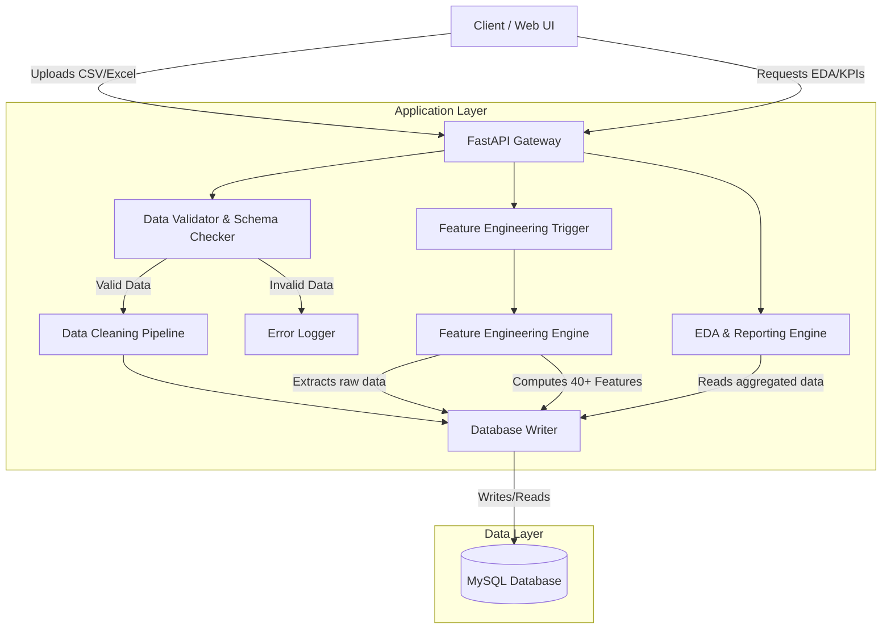
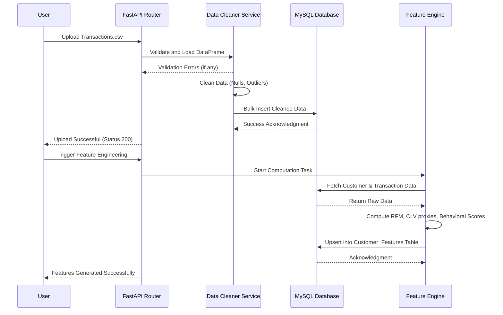

# Customer Lifetime Value (CLV) & Customer Intelligence Platform
## Part 1: System Design & Data Foundation
### Section 4: Technology Stack & Section 5: Complete System Architecture

---

## 4. Technology Stack

### Technology Selection and Rationale

| Technology | Role | Justification | Alternatives Considered |
| :--- | :--- | :--- | :--- |
| **Python 3.10+** | Core Backend Language | Industry standard for Data Science/ML. Unparalleled ecosystem (Pandas, Scikit-learn). High developer velocity. | Java, Go (Lacks native data science libraries), Node.js. |
| **FastAPI** | Backend Framework | Extremely fast, native async support, automatic interactive documentation (Swagger UI), Pydantic for robust data validation. | Flask (Slower, manual validation), Django (Too heavy for a microservice architecture). |
| **MySQL 8.0** | Relational Database | ACID compliant, highly reliable, excellent support for complex joins and aggregations required for EDA. Familiar to all Data Analysts. | PostgreSQL (Excellent alternative, but MySQL was chosen for widespread shared-hosting compatibility for SMBs), MongoDB (Not suitable for highly relational customer/transaction data). |
| **SQLAlchemy** | ORM (Object Relational Mapper) | Abstracts SQL dialects, prevents SQL injection, allows complex database modeling using Python classes. | Django ORM (Tied to Django), Peewee (Less robust for enterprise). |
| **Pandas / NumPy** | Data Processing Engine | Vectorized operations allow for lightning-fast data cleaning, aggregation, and feature engineering in memory. | PySpark (Overkill for SMB datasets < 10GB), Polars (Faster, but Pandas has wider community support and is standard for portfolios). |
| **Scikit-Learn / XGBoost** | ML Foundation (Prep) | While deep ML is in Part 2, these are standard for baseline modeling. Data foundation is built to output arrays compatible with these libraries. | TensorFlow/PyTorch (Overkill for tabular CLV data). |
| **Matplotlib / Plotly** | Visualization Engine | Plotly provides interactive JSON chart configurations that the frontend can render natively. Matplotlib for static reporting. | Seaborn (Static only), D3.js (Requires heavy frontend lifting). |
| **OpenPyXL** | Excel Processing | Required to parse `.xlsx` files securely without relying on legacy COM objects. | xlrd (Depreciated for xlsx). |
| **React** | Frontend Framework | (Future Phase) Component-based architecture ideal for building dynamic dashboards. | Vue.js, Angular. |
| **Git / Docker** | DevOps & Version Control | Ensures reproducibility. Docker containerizes the API, DB, and Processing engine for seamless deployment. | Native installations (Prone to "works on my machine" issues). |

### Project Folder Structure & Responsibilities

```text
clv_platform/
├── app/
│   ├── main.py                 # FastAPI application instance and entry point
│   ├── api/                    # API Routing layer
│   │   ├── routes_upload.py    # Endpoints for file uploads
│   │   ├── routes_eda.py       # Endpoints for analytics and KPIs
│   │   └── routes_features.py  # Endpoints for triggering feature engineering
│   ├── core/                   # Application-wide settings and configurations
│   │   ├── config.py           # Environment variables and secrets
│   │   └── security.py         # JWT and password hashing
│   ├── db/                     # Database connection and session management
│   │   ├── database.py         # SQLAlchemy engine initialization
│   │   └── models.py           # SQLAlchemy ORM models (Tables)
│   ├── schemas/                # Pydantic models for API validation
│   │   ├── upload_schema.py    # Request/Response schemas for uploads
│   │   └── feature_schema.py
│   ├── services/               # Core business logic layer
│   │   ├── data_cleaner.py     # Pandas logic for handling nulls/outliers
│   │   ├── feature_engine.py   # Computes RFM and 40+ customer features
│   │   └── eda_generator.py    # Generates statistical summaries
│   └── utils/                  # Helper functions
│       ├── file_parsers.py     # CSV and Excel parsing utilities
│       └── validators.py       # Custom business rule validators
├── data/
│   ├── raw/                    # Temporary storage for uploaded files before processing
│   └── processed/              # Caching for cleaned files (if needed)
├── tests/                      # Pytest unit and integration tests
├── requirements.txt            # Python dependencies
├── Dockerfile                  # Container definition for the backend
└── docker-compose.yml          # Orchestrates API and MySQL containers
```

---

## 5. Complete System Architecture

### Overall Architecture

The platform follows a **3-Tier Microservices-inspired Architecture**:
1. **Presentation Layer**: (Frontend/API Clients) Sends datasets and requests insights.
2. **Application Layer**: (FastAPI) Handles routing, validation, business logic, data cleaning, and feature engineering.
3. **Data Layer**: (MySQL) Persists raw entities, cleaned transactions, and denormalized feature sets.

### Architecture Diagram (Mermaid)



### Layer Architecture & Data Flow

1. **Ingestion Flow**:
   - `Client` sends `POST /api/upload/{dataset_type}` with a `.csv` file.
   - `API` saves file to `data/raw/`.
   - `utils.file_parsers` loads file into a Pandas DataFrame in chunks.
   - `schemas` (Pydantic) validates column names and data types.

2. **Processing Flow**:
   - `services.data_cleaner` applies imputation, datatype correction, and standardization.
   - `db.models` maps the cleaned DataFrame to MySQL tables.
   - `pandas.to_sql()` or SQLAlchemy bulk inserts write data to MySQL.

3. **Feature Engineering Flow**:
   - User triggers `POST /api/features/generate`.
   - `services.feature_engine` pulls relational data (Customers + Transactions + Support).
   - Groups by `Customer_ID`, calculates metrics (e.g., Total Spend, Support Tickets, Days Since Last Purchase).
   - Writes back to the `Customer_Features` table in MySQL.

4. **Analytics Flow**:
   - Client requests `GET /api/eda/revenue-trends`.
   - `services.eda_generator` executes optimized SQL queries or loads specific columns into Pandas.
   - Formats data into JSON structures compatible with Plotly/Chart.js and returns to the client.

### Component Interaction (Sequence Diagram)


