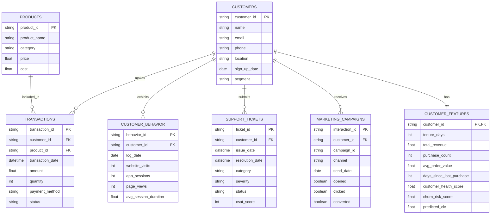

# Customer Lifetime Value (CLV) & Customer Intelligence Platform
## Part 1: System Design & Data Foundation
### Section 6: Database Design & Section 7: Dataset Design

---

## 6. Database Design

### ER Diagram

### Database Naming Conventions
- **Tables**: Plural, uppercase snake_case (e.g., `SUPPORT_TICKETS`).
- **Columns**: Singular, lowercase snake_case (e.g., `transaction_date`).
- **Primary Keys**: `<entity>_id` (e.g., `customer_id`).
- **Foreign Keys**: Exact match to the referenced Primary Key.

### Tables & Relationships Detailed

1. **CUSTOMERS**: The core entity.
   - *Indexes*: `idx_email` for fast lookups.
   - *Constraints*: `email` must be UNIQUE.

2. **TRANSACTIONS**: Fact table recording financial events.
   - *Relationships*: Many-to-One with `CUSTOMERS`, Many-to-One with `PRODUCTS`.
   - *Indexes*: `idx_transaction_date`, `idx_customer_id`.
   - *Constraints*: `amount` >= 0.

3. **PRODUCTS**: Dimension table for items sold.
   - *Constraints*: `price` > 0.

4. **CUSTOMER_BEHAVIOR**: Aggregated daily/weekly engagement logs.
   - *Relationships*: Many-to-One with `CUSTOMERS`.

5. **SUPPORT_TICKETS**: Logs of customer service interactions.
   - *Relationships*: Many-to-One with `CUSTOMERS`.
   - *Constraints*: `resolution_date` >= `issue_date`.

6. **MARKETING_CAMPAIGNS**: Logs of promotional outreach and engagement.
   - *Relationships*: Many-to-One with `CUSTOMERS`.

7. **CUSTOMER_FEATURES**: Highly denormalized table containing the 40+ engineered features.
   - *Relationships*: One-to-One with `CUSTOMERS`.
   - *Primary Key*: `customer_id` (acts as both PK and FK).
   - *Purpose*: Optimized purely for Machine Learning ingestion and fast EDA querying. No complex joins required to fetch a customer's entire profile.

---

## 7. Dataset Design

For the platform to function, users upload data matching specific schemas. The system is designed to be forgiving, but defining the optimal dataset structure is crucial.

### 1. Customers.csv
- **Purpose**: Defines the master list of clients.
- **Columns**:
  - `customer_id` (String, Required): Unique identifier.
  - `name` (String, Optional): Customer name.
  - `email` (String, Required): Email address.
  - `location` (String, Optional): City/State/Country.
  - `sign_up_date` (Date, Required): Date acquired.
- **Validation Rules**: `email` must match regex pattern; `sign_up_date` must be a valid date format (ISO 8601 preferred).
- **Typical Errors**: Duplicated emails, varying date formats (MM/DD/YYYY vs DD/MM/YYYY).
- **Cleaning Strategy**: Deduplicate by `email` keeping the most recent. Standardize dates to `YYYY-MM-DD`.

### 2. Transactions.csv
- **Purpose**: Financial heartbeat. Drives Monetary and Frequency features.
- **Columns**:
  - `transaction_id` (String, Required): Unique ID.
  - `customer_id` (String, Required): Must exist in Customers.csv.
  - `product_id` (String, Optional): Links to product catalog.
  - `transaction_date` (Datetime, Required): When it occurred.
  - `amount` (Float, Required): Revenue generated.
  - `status` (String, Required): 'Completed', 'Refunded', 'Failed'.
- **Validation Rules**: `amount` cannot be negative unless `status` is 'Refunded'.
- **Data Quality Issues**: Currency symbols in amount column (e.g., "$1,200.50").
- **Cleaning Strategy**: Regex strip currency symbols and commas. Convert to float. Drop 'Failed' transactions for revenue calculations.

### 3. Products.csv
- **Purpose**: Enhances transaction data with margin and category info.
- **Columns**: `product_id`, `product_name`, `category`, `price`, `cost`.
- **Business Meaning**: Allows calculation of Customer Lifetime *Profit* rather than just Revenue.

### 4. Marketing.csv
- **Purpose**: Tracks engagement with outbound campaigns.
- **Columns**: `customer_id`, `campaign_id`, `channel` (Email, SMS, Ads), `send_date`, `opened` (1/0), `clicked` (1/0).
- **Validation Rules**: Binary columns must be 1, 0, True, or False.
- **Cleaning Strategy**: Fill missing binary values with 0.

### 5. Customer_Behavior.csv
- **Purpose**: Captures product/website usage, crucial for predicting churn before revenue drops.
- **Columns**: `customer_id`, `log_date`, `website_visits`, `app_sessions`, `avg_session_duration`.
- **Validation Rules**: Counts must be integers >= 0.

### 6. Support.csv
- **Purpose**: Customer satisfaction and friction indicators.
- **Columns**: `ticket_id`, `customer_id`, `issue_date`, `category`, `severity` (Low, Medium, High), `csat_score` (1-5).
- **Cleaning Strategy**: Standardize `severity` to ordinal integers (1=Low, 2=Medium, 3=High). Impute missing `csat_score` with the median.
